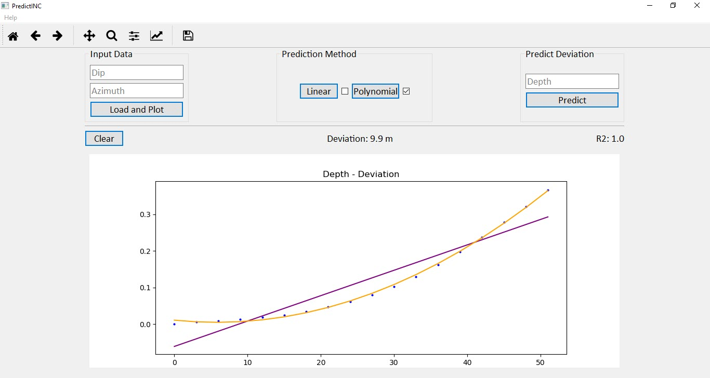

# PredictINC
Desktop application for predicting borehole deviation at specified depth.

The main script has been written in Python and its libraries:

Pandas - for reading input (CSV) data and manipulation;

Numpy - for calculations;

Matplotlib - for visualization;

Scikit-learn - for regression analysis;

Pyqt5 - for Graphical User Interface.
